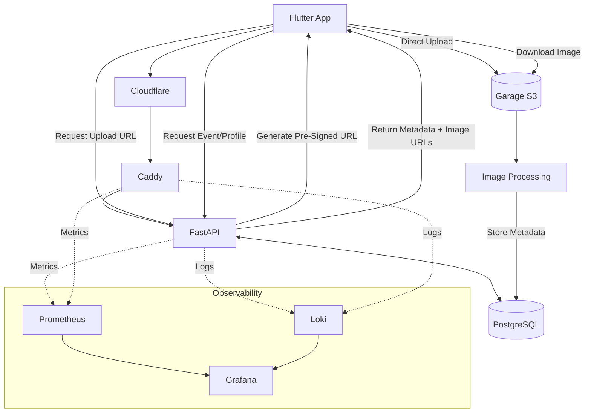

How I designed, built and operate a self-hosted platform as a solo engineer, making deliberate trade-offs around cost, reliability, simplicity and operational ownership.
- [Jump to the upscaling post](https://kin1m0d.github.io/projects/dancehub/2026/06/20/dnc-upscaling.html)
- [Jump to the observability post](https://kin1m0d.github.io/projects/dancehub/2026/06/23/dnc-observability.html)


<br/>

<div style="background-color: #fff9e6; border-left: 4px solid #f59e0b; color: #78350f; padding: 16px; margin: 20px 0; border-radius: 4px;" markdown="1">
💡 **Work in Progress**  
This page is currently under construction. A few pieces are missing and I might adjust small bits.
</div>

<br/>


# Introduction

What is this about? Let me start with, what it is not. This is not a proof of concept, it's not a pet project that goes to the code graveyard. It's also not AI slop, or vibe coded. 

So am I not using AI at all? Quite the contrary, I'm heavily using AI, but in a controlled way, I know what is going on under the hood, this is called AI assisted development. In fact, without AI I wouldn't be able to have developed this platform within the last few months, in my free time, while having a full time job, all by myself. In a way, AI enables me to become the 10x engineer that we all want to be. Maybe 10x is slightly exaggerated, proabably more like 2x-3x? My point is, I can move much quicker than before.

**So, what is it then?** In simple words, it's a platform for dancers where they can find all kinds of events in one place. While it's still early stages, this is production grade quality, or can I just say made in Germany? Well that would be a lie, I live in London. What about *made by a German*? You'll get the point, it's German quality.

**Why am I doing this?** For one I love building things, I can put all my knowledge together into one project. From a dancers perspective, this is something to enrich the dance community, not just for salsa and bachata, this is a place for all dance styles.


---


# Design Principles
- Cloud agnostic
- Open source first
- Self-hosted where practical
- Low cost and able to exist without funding
- Simplicity over complexity
- Operable by one person
- Scale when required

This list has influenced all technical decision in the project.


---


# Architecture Overview
The platform uses a traditional three-tier architecture, with a Flutter frontend, FastAPI backend and PostgreSQL database. The backend is implemented as a monolith, it's my Swiss Army knife (I actually don't have one). Additional supporting services handle object storage, monitoring, deployments and security.

- show diagram


## Request flow
The API acts as the central entry point for business logic, authentication and data access. PostgreSQL stores application data such as users, events and image metadata. Images follow a slightly different path. Instead of uploading files through the API, the platform uses pre-signed URLs. When a user wants to upload an image, the application first requests permission from the API. The API performs any validation and then generates a temporary upload URL.

The client can then upload the image directly to Garage without the API acting as a middleman. Once the upload is complete, the API processes the image, generates additional sizes and stores the relevant metadata in PostgreSQL.

When users later browse events or profiles, the API returns metadata and image URLs, while the actual image content is served directly from Garage. This keeps large file transfers away from the API, reduces bandwidth requirements on the application layer and allows the backend to focus on business logic instead of acting as a file proxy.




---


## CI/CD
When code is pushed to GitHub, GitHub Actions builds a new Docker image and publishes it to Docker Hub. Deployments are handled by a separate workflow.

```text
Git Push
    ↓
GitHub Actions
    ↓
Build Docker Image
    ↓
Docker Hub
```

```text
Deploy Workflow
    ↓
SSH to Target Environment
    ↓
docker compose pull
    ↓
docker compose up -d
```

Having a dedicated deployment workflow gives me more control over when and where a new version gets deployed. A successfully built image doesn't automatically mean it should immediately reach every environment.

As someone with a release engineering background, I value predictable and repeatable deployment processes. Automation becomes even more important when you're a one-man army. Every manual step is another opportunity for human error, configuration drift or forgotten deployment procedures. By automating the process, deployments remain consistent regardless of how often I perform them.

Could I implement GitOps (I'd love to), blue-green deployments or more advanced release strategies? Sure, but do I need them today? No. For a platform of this size, a simple deployment process that's easy to understand and easy to maintain provides more value than a complex system that solves problems I don't have yet.

## Environments: Dev vs Stage vs Prod

I'm working with three environments, local development, staging and production. You might think this is overkill for a project of that size. But having spent two years working as a Release Engineer, I've learned that production should never be where you discover whether a change works.

It sounds obvious, but it's surprisingly easy to convince yourself that a "small change" doesn't need testing. My staging environment runs on my home server and exists for exactly that reason. It allows me to validate not just application changes, but also deployment changes, infrastructure changes and configuration changes before they reach production.

I've made that experience myself, "oh that small Caddy config change could go to prod right away" I thought moments before realising that my app couldn't connect to the backend anymore.

My advice, use multiple environments! Investing the extra time in multiple environments is definitely worth it, if you want to avoid turning production into a playground.


---
## Why One VPS Is Enough (For Now)
- Acknowledge SPOF
- Explain trade-offs
- Cost vs complexity
- Avoiding premature optimisation

Let's address the elephant in the room, it runs all one a single server?? I know I know, it's a single point of failure. This is an accepted risk, at this stage it doesn't make sense to scale up, so for now the complexity and cost can stay low. Check out my [upscaling post](https://kin1m0d.github.io/projects/dancehub/2026/06/20/dnc-upscaling.html) if you're interested in further optimisations.


---
## Why I Chose a Monolith
When I first started thinking about the archtiecture, I was dreaming of microservices, all written in Go, autoscaling with Kubernetes and all that fancy stuff. But do you know the complexity of distributed systems? Just think about deployments, networking, monitoring, or debugging. Every service boundary eventually becomes an operational burden.

I want to move fast, and keep things simple (even though difficult is more fun lol), and I'm the only engineer working on the platform, so let's stay realistic and keep the fancy stuff away. For now, because knowing me, I'd happily move to Kuberentes and make evertyhing even more complicated, and of course I'll manage the cluster myself instead of going for GKE or similar.


---
## Cloud Agnostic by design

No managed services? Really?

Just to clarify this, I'm not fully avoiding them, for example I use GitHub Actions or Docker Hub to make my life easier, but the actual platform is free of managed services. And I'm not against them! They're great and in many cases it's a smart move to use them! They usually provide a smoother experience, they handle upgrades, backups, monitoring and operational headaches for you. By choosing portable, self-hosted alternatives, I'm taking ownership of those responsibilities myself.

So why am I not using Supbase, Appwrite, Clerk, Auth0, Firabase etc. and push everything to Vercel and I'm done? Everyone does that? Doing everything myself is so much more operational overhead? Exactly, this is the whole point.


<div class="tenor-gif-embed" data-postid="4830492" data-share-method="host" data-aspect-ratio="2.08333" data-width="100%"><a href="https://tenor.com/view/this-is-where-the-fun-begins-star-wars-anakin-sassy-excited-gif-4830492">This Is Where The Fun Begins Star Wars GIF</a>from <a href="https://tenor.com/search/this+is+where+the+fun+begins-gifs">This Is Where The Fun Begins GIFs</a></div> <script type="text/javascript" async src="https://tenor.com/embed.js"></script>


Yes I want to move fast and this slows me down, but that's okay, I'm not a startup that has to reach milestones for more funding.

A few other reasons why I choose to go the more difficult way:
- Unpredictable costs, once you leave the free tier it can get quite expensive
- Vendor lock-in, they can change their rules at anytime
- Data sovereignty, I want to be in control of the data and eventualy be GDPR compliant
- Architectural control, while I'm being far away from optimising every bit, this could be a limitation if you're working with a black box

It's a conscious trade-off. I accept a little more operational work in exchange for lower costs, fewer external dependencies and the freedom to move the platform wherever I want. Will I stay cloud agnostic forever? Most probably not. If the operational overhead becomes too much and the benefits outweigh the costs, that's the point where I'll switch.


---
## Tech Stack

### Database (Postgres)
When I started prototyping I was using MongoDB, just because I thought with NoSQL I can stay flexible and not be restricted by any schema, as I'm changing things constantly. The truth is, you just move that contract onto the app layer, now everytime my app reads from the database, I have to do all kinds of checks, if, else, are you a list? what data are you? There is no guarantee documents are all the same, there are so many ways to mess this up.

Now with Postgres, I'll define the schema upfront, the data that goes in has to follow that contract, that means the data that comes out is consistent, I don't need to do any crazy validations. As long as the app knows how to read the data, there is no way to get it wrong.

And one thing that made me really happy as well, was the native UUID v7 support coming along with Postgres 18.

### Mobile app (Flutter)
That was an easy choice to make, I needed something that makes app development for Android **and** iOS simple. I had never used Flutter or written a single line of Dart, so I had to learn this from scratch, but it's very similar to Java or C#.

### Backend (FastAPI)
My initial goal was to go with Go (lol), I'm just not that familiar with the language. I had written some Go before, but it was more like "I want to do x, let me google how to do x". To speed things up, I decided to start prototyping with Python and switch later to Go. Well I sticked to my beloved Python code as I'm already learning Flutter.

But why FastAPI and not Django or Flusk? I was looking for simplicity and performance, FastAPI is build on Starlette and Uvicorn, which gives me `async`. Why is that so good? In synchronous coding, when a request waits for a slow operation, like a database query or an external API call, the entire execution thread stops and waits. With async, the execution thread immediately moves on to serve the next request while waiting for the slow operation to finish.

[Click here for more FastAPI fundamentals](https://dev.to/kfir-g/understanding-fastapi-fundamentals-a-guide-to-fastapi-uvicorn-starlette-swagger-ui-and-pydantic-2fp7)

### Object storage (Garage)
This is something I completely overlooked, I forgot that I need images for my events, or user profiles, but where do I store them? Object storage of course, but still, wheeere? There are too many solutions, following my design principles, I boiled it down to 
- MinIO, sounded like the perfect solution until I realised they're not open source anymore
- Ceph (RGW), enterprise-grade, massive-scale storage and notoriously complex to set up and manage, no thanks
- RustFS, quite new but it's in alpha stage, might be not production ready?
- SeaweedFS, that seemed quite promising actually, until I found out that it's more complicated to deploy
- Garage, hugely popular in the selfhosted community, easy and lightweight, s3 compatible -> yeap Garage it is

### Reverse proxy (Caddy)
Which proxy do I choose, this was a battle between Traefik, HAProxy, Nginx and Caddy. I'm not going into details here, this blog post [reverse-proxy-showdown](https://hostim.dev/blog/reverse-proxy-showdown/) describes the differences quite well, and I choose simplicity.

### Cloud Service Provider (Hetzner)
This research took a long time, there are plenty of options and so many differences in terms of pricing and what they have to offer in general. I actually had my prototype running on GCP, but went for Hetzner, simply because of the low compute and storage cost, infrastructure is in Germany -> GDPR check. And lastly Germany is central Europe, that should keep the latency low for everyone (well only for Europeans of course).

### Observability
Check out this [post](https://kin1m0d.github.io/projects/dancehub/2026/06/23/dnc-observability.html).


---
## Infrastructure as Code
While I'm not using any specific servers from any cloud provider, 
While Terraform makes it easy to switch between providers, I would still need to adjust the code to make it work for that specific provider. But that is only a minor annoyance, and the main goal to avoid vendor lock in is achieved.

To provision one single server that is quite easy and almost not worth talking about it. But the plan is to go multi-cloud with multiple environments. I guess the biggest challenge is to write modules that have the same interface, that allow me to switch seemlessly between providers. With a generic cloud-init script I can prepare the nodes to join the VPN mesh and install Docker and other things. I don't like the idea of Terraform workspaces, so I'll go the multi-directory path. That brings me to the question, should I use Terragrunt? Nah not yet, I'll look into this when the complexity increases. What to do with my state file, I might just put it in my Onedrive? Problem solved lol.


---
## Security
- Proxy: Cloudflare sits at front in the trenches, acting as a shield that hides my actual VPS IP. DDoS attack? No problem, Cloudlfare absorbs it
- TLS: Caddy handles all the SSL/TLS certificates automatically behind the scenes
- Firewall: Everything that is not port 80, 443 gets blocked, HTTP traffic gets redirected to HTTPS
- SSH: Only SSH keys allowed
- Brute force mitigation: Intrusion detector blocks any brute force attacks
- Docker isolation: Containers live in an isolated internal Docker network, keeping the database completely hidden from the public internet
- Secrets: GitHub Actions pushes updates using encrypted repository secrets to handle SSH keys, no credentials ever touch the codebase
- Proactive monitoring: Alert if system resources showing weird resource spikes that might point to a security breach
- Secure Auditing: Loki will centralize application logs to help trace any suspicious activity
- Dependencies: Integrate Dependabot to catch insecure packages
- SAST: For automated static security testing, Snyk will be added to the pipline


